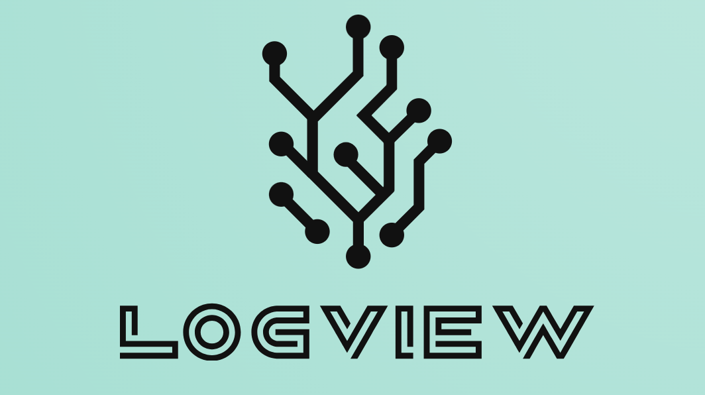

[](https://www.gnu.org/licenses/gpl-3.0)

Query Builder (VelUI): Interactive Process Mining Queries Powered by LogView

<!-- PROJECT LOGO -->
<br />
<div align="center">
  <a href="https://github.com/othneildrew/Best-README-Template">
    
  </a>
</div>

## About the project
We present **Query Builder (VelUI)**, an interactive tool that extends LogView’s process mining framework with visual, no-code capabilities for building, running, and comparing event log queries. With Query Builder, you can create complex queries, manage multiple analyses, and review results all in one place. This brings process analytics to everyone, not just programmers.
Under the hood, Query Builder is powered by **LogView**, a Python framework that records, tracks, and compares event log queries and their results. LogView is implemented as a standalone library to help you integrate it into your existing process mining environments.


<!-- GETTING STARTED -->
## Getting Started

To get a local copy up and running follow these simple example steps.

### Prerequisites
LogView can be installed on Python 3.9.x / 3.10.x / 3.11.x / 3.12.x.

This is an example of how to create a conda environment with python 3.10 in case you don't have one:
*
    ```sh
    conda create -n logview_env python=3.10
    conda activate logview_env
    ```

### Installation

LogView hasn't been uploaded to the Python Package Index yet.
However, there's no need to worry! We can easily guide you through installing it locally in just two simple steps.

1. Clone the repo
   ```sh
   git clone https://github.com/blindreview-logview123/logview.git
   cd logview
   ```
2. Install LogView
   ```sh
   python setup.py sdist bdist_wheel
   pip install .
   ```

If you wish to execute the examples in the notebook files, please ensure that you have 'ipykernel' installed in your Python environment.
If it's not install, you can easily install it as follows:

* install `ipykernel` with pip
    ```sh
    conda activate logview_env
    pip install ipykernel
    ```

### Import ###
Once installed, you can import LogView into their Python scripts or Jupyter Notebooks:
```python
import logview
```
<!-- USAGE FEATURES -->

## Key Features ##
Query Builder (VelUI) brings LogView into an interactive, visual workspace with:
- Multiple queries in tabs: Easily create, manage, and compare different analyses in separate tabs.
- Dynamic, context-aware input: Input fields and options update based on the predicates and conditions you choose.
- Live query preview: See your query string update in real time as you configure it.
- Instant results: Run queries directly from the UI and see the output immediately.
- Query summary and history: Review all your executed queries and results in one place.
All queries, results, and comparisons are powered by the LogView backend so you get full analytics, but in a much more accessible way.


<!-- USAGE EXAMPLES -->
## Usage Examples ##

In the example below, we show how the query is constructed.


<!-- NOTEBOOKS -->
## Notebooks

For a detailed tutorial on how to use QueryBuilder and a case study on a real-life event log, please refer to the [velUI.ipynb](https://github.com/divyalekha99/Query_Builder/blob/main/vel/velUi.ipynb) tutorial.
 _please refer to our *Notbooks* section and folder to understand logview framework_

<!-- CONTRIBUTING -->
## Contributing
If you have a suggestion that would make our project better, please let us know!
You can fork the repo and create a pull request. You can also simply open an issue with the tag "enhancement".

1. Fork the Project
2. Create your Feature Branch (`git checkout -b feature/AmazingFeature`)
3. Commit your Changes (`git commit -m 'Add some AmazingFeature'`)
4. Push to the Branch (`git push origin feature/AmazingFeature`)
5. Open a Pull Request

<!-- LICENSE -->
## License
Distributed under the GPL-3.0 License. See `LICENSE.txt` for more information.
